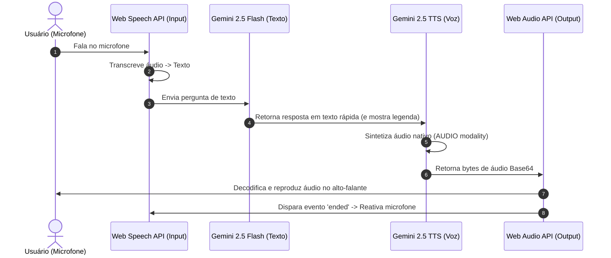

# Guia de Implementação: IA Conversacional por Voz (Natural e Fluida)

Este guia descreve a arquitetura técnica e fornece os templates de código necessários para implementar um assistente de conversação por voz natural e em tempo real no nosso serviço. A arquitetura foi analisada a partir do projeto `chamaamor-main` e otimizada para alto desempenho, consistência de áudio e compatibilidade com navegadores de PC e dispositivos móveis.

---

## 🗺️ Fluxo Geral da Conversa por Voz

A conversa flui de forma cíclica e atômica, garantindo que a IA nunca fale enquanto o usuário está falando, e reative a escuta de forma inteligente assim que terminar de responder.



---

## 🚀 Pilares da Implementação Técnica

### 1. Entrada de Voz (Speech-to-Text)
Utiliza a API nativa dos navegadores (`window.SpeechRecognition` ou `window.webkitSpeechRecognition`).

> [!IMPORTANT]
> **Compatibilidade Mobile:** Em dispositivos móveis (especialmente Safari/iOS), o microfone só pode ser ativado a partir de um clique explícito do usuário. Não tente iniciar o reconhecimento dentro de efeitos automáticos (`useEffect` ou `onload`) sem ação direta.

#### Template de Inicialização:
```typescript
const startSpeechRecognition = async () => {
  // 1. Solicita permissão de áudio explicitamente por gesto do usuário
  if (navigator.mediaDevices && navigator.mediaDevices.getUserMedia) {
    try {
      const stream = await navigator.mediaDevices.getUserMedia({ audio: true });
      stream.getTracks().forEach(track => track.stop()); // Libera o microfone para a SpeechRecognition usar
    } catch (err) {
      console.error("Permissão de microfone negada:", err);
      return;
    }
  }

  // 2. Instancia o reconhecimento de voz do navegador
  const SpeechRecognition = (window as any).SpeechRecognition || (window as any).webkitSpeechRecognition;
  if (!SpeechRecognition) {
    console.warn("Reconhecimento de fala não suportado.");
    return;
  }

  const recognition = new SpeechRecognition();
  recognition.lang = 'pt-BR';
  recognition.continuous = false; // Parar após uma frase (facilita o controle de turnos)
  recognition.interimResults = false;

  recognition.onstart = () => {
    console.log("IA está ouvindo...");
  };

  recognition.onresult = (event: any) => {
    const transcript = event.results[0][0].transcript;
    if (transcript && transcript.trim().length > 0) {
      console.log("Usuário disse:", transcript);
      // Envia o texto obtido para o pipeline do Gemini
      processAIConversation(transcript);
    }
  };

  recognition.onerror = (e: any) => {
    console.error("Erro no reconhecimento de fala:", e.error);
  };

  recognition.start();
};
```

---

### 2. Pipeline da IA em Duas Etapas (Lógica + Voz Nativa)
Para obter uma resposta rápida e reduzir o tempo de latência perceptível pelo usuário:
1. **Etapa 1 (Texto)**: O modelo `gemini-2.5-flash` decide a resposta lógica. Mostramos a legenda na tela imediatamente.
2. **Etapa 2 (Voz Nativa)**: Enviamos o texto da resposta para o modelo `gemini-2.5-flash-preview-tts` solicitando a modalidade `AUDIO` e especificando a voz nativa configurada.

#### Exemplo de Chamada de API (SDK `@google/genai`):
```typescript
import { GoogleGenAI } from '@google/genai';

const ai = new GoogleGenAI({ apiKey: 'SUA_API_KEY' });

async function generateConversationalResponse(userText: string, voiceName: 'Puck' | 'Kore' | 'Fenrir' = 'Kore') {
  // Passo A: Gerar texto e atualizar a UI rapidamente
  const textResponse = await ai.models.generateContent({
    model: 'gemini-2.5-flash',
    contents: [{ role: 'user', parts: [{ text: userText }] }],
    config: {
      systemInstruction: "Responda de forma curta, natural e conversacional, como se estivesse em uma ligação telefônica rápida."
    }
  });

  const aiText = textResponse.candidates?.[0]?.content?.parts?.[0]?.text || "";
  // Exibir legenda na tela de imediato...
  updateSubtitleUI(aiText);

  // Passo B: Sintetizar a resposta de áudio de alta fidelidade
  const ttsResponse = await ai.models.generateContent({
    model: 'gemini-2.5-flash-preview-tts',
    contents: [{ role: 'user', parts: [{ text: aiText }] }],
    config: {
      responseModalities: ['AUDIO'],
      speechConfig: {
        voiceConfig: { prebuiltVoiceConfig: { voiceName: voiceName } }
      }
    }
  });

  const audioPart = ttsResponse.candidates?.[0]?.content?.parts?.find((p: any) => p.inlineData?.data);
  const base64Audio = audioPart?.inlineData?.data; // Áudio base64 retornado
  const mimeType = audioPart?.inlineData?.mimeType || "audio/wav";

  return { aiText, base64Audio, mimeType };
}
```

---

### 3. Decodificação e Reprodução Sem Delay (Web Audio API)
Reproduzir áudio usando blocos fragmentados de rede pode causar cortes indesejados. Para garantir fluidez total, decodificamos a resposta completa e tocamos a partir da memória do navegador (`AudioBuffer`).

> [!TIP]
> **Controle de Turno:** Usar o evento `'ended'` no nó do buffer de áudio garante que o microfone só seja religado quando a IA terminar de pronunciar a última palavra.

```typescript
let audioCtx: AudioContext | null = null;
let activeSourceNode: AudioBufferSourceNode | null = null;

const getAudioContext = () => {
  if (!audioCtx) {
    audioCtx = new (window.AudioContext || (window as any).webkitAudioContext)();
  }
  if (audioCtx.state === 'suspended') {
    audioCtx.resume();
  }
  return audioCtx;
};

// Função para desbloquear o áudio mobile no primeiro clique do usuário
export const unlockAudio = () => {
  const ctx = getAudioContext();
  const buffer = ctx.createBuffer(1, 1, 22050);
  const source = ctx.createBufferSource();
  source.buffer = buffer;
  source.connect(ctx.destination);
  source.start(0);
};

export const playAudioResponse = async (base64Audio: string, mimeType: string, onAudioEnd: () => void) => {
  const ctx = getAudioContext();

  try {
    // 1. Converter Base64 em Array de Bytes
    const rawBinary = window.atob(base64Audio);
    const bytes = new Uint8Array(rawBinary.length);
    for (let i = 0; i < rawBinary.length; i++) {
      bytes[i] = rawBinary.charCodeAt(i);
    }

    // 2. Decodificar bytes em um buffer de áudio na memória
    let audioBuffer: AudioBuffer;
    if (mimeType.includes('wav')) {
      // Caso a resposta retorne cabeçalho wav específico do Gemini
      audioBuffer = await ctx.decodeAudioData(bytes.buffer);
    } else {
      audioBuffer = await ctx.decodeAudioData(
        bytes.buffer.slice(bytes.byteOffset, bytes.byteOffset + bytes.byteLength)
      );
    }

    // Parar qualquer áudio da IA tocando anteriormente
    if (activeSourceNode) {
      activeSourceNode.stop();
    }

    // 3. Criar e tocar a fonte
    const source = ctx.createBufferSource();
    source.buffer = audioBuffer;
    source.connect(ctx.destination);

    // Quando o áudio acabar de tocar, chamamos o callback (ex: reativar escuta do usuário)
    source.onended = () => {
      activeSourceNode = null;
      onAudioEnd();
    };

    activeSourceNode = source;
    source.start(0);
  } catch (error) {
    console.error("Falha ao reproduzir áudio da IA:", error);
    onAudioEnd(); // Garante o fluxo mesmo em caso de falha
  }
};
```

---

## 💡 Melhores Práticas Recomendadas

1. **Vozes Nativas do Gemini**: Utilize vozes como `Kore`, `Puck`, `Fenrir` ou `Charon` configuradas diretamente no `speechConfig` da chamada do Gemini. Elas fornecem entonação humana ultra realista e eliminam a necessidade de sintetizadores de voz terceiros.
2. **Microfone Exclusivo**: Sempre pare o reconhecimento de fala (`recognition.stop()`) antes que a IA comece a reproduzir o áudio de resposta, evitando que ela escute o próprio alto-falante.
3. **Unificação do AudioContext**: Inicialize o `AudioContext` em um evento síncrono de clique do usuário (como o botão de "Iniciar Conversa"). Isso resolve definitivamente a restrição de autoplay no mobile (Safari/Chrome).
