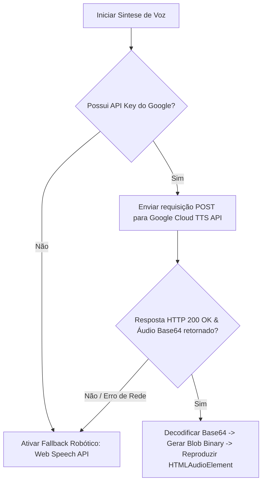

# Arquitetura de Integração de Voz: Neural Moderno (Google Cloud TTS) vs. Fallback Robótico (Web Speech API)

Este documento explica detalhadamente como o pipeline de áudio do aplicativo **Linguo** está estruturado. O objetivo é servir como guia de suporte para que desenvolvedores e outras IAs entendam o fluxo de controle de voz, como diagnosticar a queda para a voz robótica, e como expandir este sistema.

---

## 🗺️ Fluxo Geral de Decisão de Áudio

Quando o aplicativo solicita uma fala (seja do tutor conversacional ou do leitor de frases), ele segue a seguinte hierarquia de execução:

---

## 1. O Pipeline Moderno: Google Cloud Text-to-Speech (Neural)

A síntese moderna e natural utiliza a API do **Google Cloud Text-to-Speech**, especificamente vozes **Neural2** e **Wavenet**, que fornecem entonação realista de alta qualidade.

### A. Fluxo de Execução Técnica
1. **Verificação de Chave**: O motor de áudio obtém a chave de API nos seguintes locais prioritários:
   - Em tempo de execução do estado global: `(window as any).__GOOGLE_TTS_KEY__`
   - Cache de persistência local: `localStorage.getItem('hanzi_dial_google_tts_key')`
   - Variável de ambiente (build time): `import.meta.env.VITE_GOOGLE_TTS_API_KEY`
   - Fallback hardcoded temporário.
2. **Chamada REST**: É enviado um POST para `https://texttospeech.googleapis.com/v1/text:synthesize?key=API_KEY`.
3. **Parâmetros da Requisição**:
   - `input`: O texto higienizado (removendo pontuações estranhas).
   - `voice`: Define a voz neural adequada com base no idioma (ex: `pt-BR-Neural2-A` para português, `en-US-Neural2-F` para inglês).
   - `audioConfig`: Configurado para codificação de áudio `MP3` e velocidade de fala dinâmica.
4. **Tratamento de Áudio para Dispositivos Móveis (Safari/Chrome)**:
   - Dispositivos móveis costumam travar ou corromper dados de áudio em formato puro de string Base64 (`data:audio/mp3;base64,...`).
   - Para resolver isso, decodificamos a string base64 (`audioContent`) em um array binário (`Uint8Array`) em JavaScript.
   - Criamos um objeto `Blob` binário a partir desses bytes: `new Blob([bytes], { type: 'audio/mp3' })`.
   - Geramos uma URL temporária apontando para o blob: `URL.createObjectURL(blob)`.
   - Instanciamos o áudio nativo `new Audio(blobUrl)`.
   - Limpamos a memória do navegador descartando a URL após a reprodução: `URL.revokeObjectURL(blobUrl)`.

---

## 2. O Pipeline de Fallback: Web Speech API (Robótico)

Se a requisição HTTP falhar (por limites de cota da chave de API, falta de conexão à internet, ou chave inválida/ausente), o sistema imediatamente cai para a **Web Speech API** integrada do próprio navegador do usuário (`window.speechSynthesis`).

### Características do Fallback:
- **Sem Custos**: Executado localmente no dispositivo.
- **Qualidade Variável**: A voz gerada depende inteiramente dos pacotes de voz instalados no sistema operacional do usuário (Windows, Android, iOS). Por esse motivo, muitas vezes soa metálica, artificial ou "robótica", especialmente em navegadores móveis sem sintetizadores de alta qualidade instalados nativamente.
- **Sincronismo Diferente**: Não retorna dados de áudio (Blob); o controle é delegado ao sintetizador nativo do sistema operacional.

---

## 🔍 Diagnóstico: Por que a voz está caindo no Fallback Robótico?

Se você está ouvindo a voz robótica/metálica, isso indica que a requisição de alta qualidade da API do Google Cloud falhou. Para diagnosticar o motivo exato:

1. **Abra o Console de Desenvolvedor (F12 / Inspect Element)**.
2. **Observe os Logs e Erros**:
   - **Erro 403 (Forbidden)**: Indica que a chave de API fornecida é inválida, está sem permissões, ou a API **Cloud Text-to-Speech** não foi ativada no console do Google Cloud Platform (GCP).
   - **Erro 429 (Too Many Requests)**: Indica que a cota gratuita ou o faturamento (billing) associado à sua chave do Google Cloud expirou/atingiu o limite.
   - **Erro de Rede (CORS ou falha de fetch)**: Pode indicar que a requisição foi bloqueada por extensões de bloqueio de anúncios ou problemas de conexão do próprio cliente.

### Como Corrigir no Console do Google Cloud (GCP):
1. Acesse o [Google Cloud Console](https://console.cloud.google.com/).
2. Certifique-se de que o **Faturamento (Billing)** do projeto está ativo.
3. Vá em **APIs e Serviços** > **Biblioteca**.
4. Procure por **Cloud Text-to-Speech API** e clique em **Ativar**.
5. Crie ou recupere uma credencial de chave de API em **Credenciais** e insira-a no campo de configurações do aplicativo.

---

## 🛠️ Onde Encontrar e Modificar no Código

Os dois arquivos abaixo controlam todo o pipeline de voz do aplicativo:

*   **[audio.ts](file:///c:/Users/Millerium/Downloads/discando-idioma-main/discando-idioma-main/src/utils/audio.ts)**:
    - `speakWithGoogleTTS()`: Função que realiza o POST HTTP do Google Cloud, faz a decodificação Base64 -> Blob binário e gerencia o ciclo de reprodução.
    - `speakLanguageText()`: Função gateway que tenta a API do Google Cloud primeiro e, em caso de falha (retorno `false`), ativa a Web Speech API nativa.
*   **[aiTutorEngine.ts](file:///c:/Users/Millerium/Downloads/discando-idioma-main/discando-idioma-main/src/utils/aiTutorEngine.ts)**:
    - `_speakGoogleTTS()`: Motor equivalente ao do tutor de voz conversacional que lê as introduções, elogios e análises do assistente Linguo em português, contendo a fila de reprodução de voz consecutiva.
